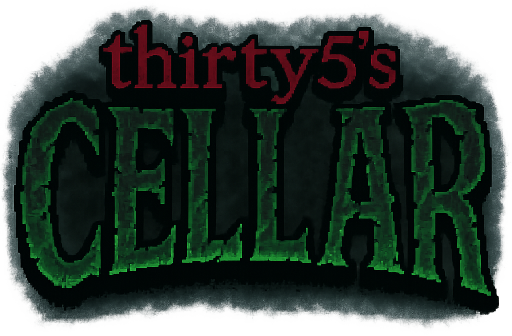

# thirty5's CELLAR

  

A dark pixel-art sandbox platformer built with Phaser 3 and Vite.

Players explore a corrupted, fog-covered world filled with traps, enemies, and dangerous terrain. Trial by death reveals paths to interaction points, encouraging exploration.

## Tech Used

| Tool            | Purpose                                  |
|-----------------|-------------------------------------------|
| [Phaser 3](https://phaser.io/)       | Game engine & rendering             |
| [Phaser Editor 4](https://phasereditor2d.com/) | Visual scene/prefab design         |
| [Vite](https://vitejs.dev/)         | Fast bundler + dev server           |
| JavaScript       | Core game logic                           |
| VS Code          | Primary development environment           |
